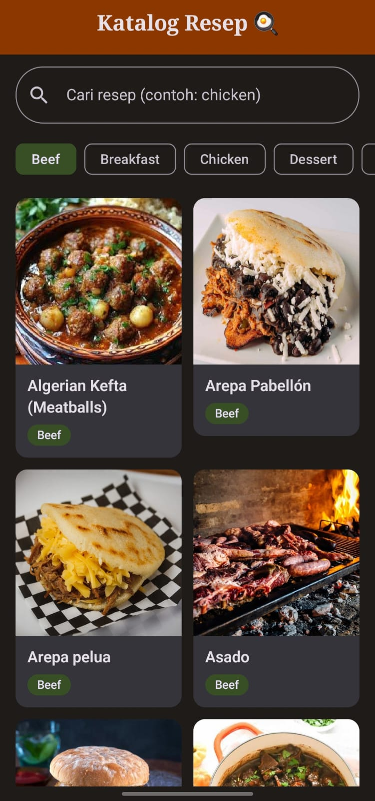
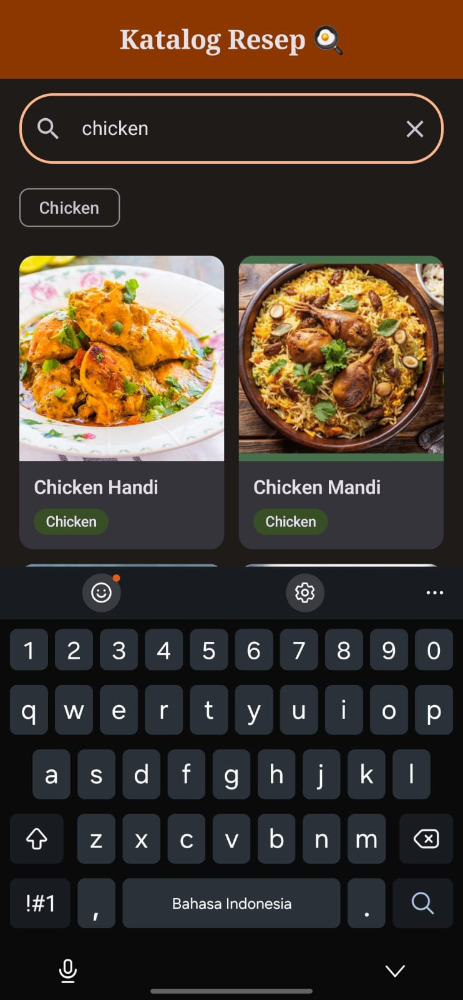
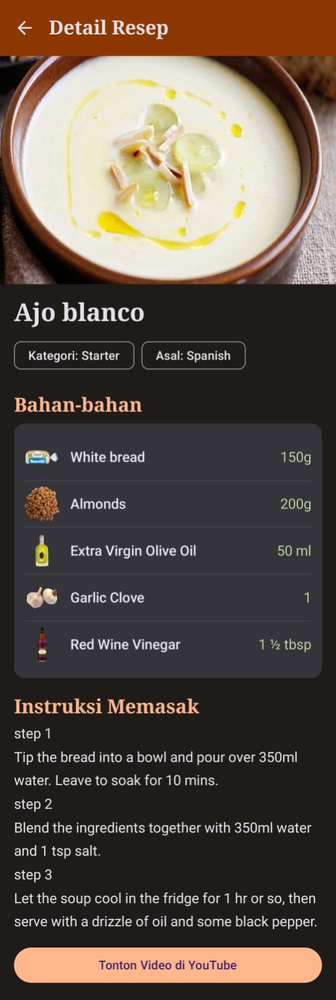

# Katalog Resep
> Jelajahi ribuan resep masakan dari seluruh dunia dalam genggaman.

---

## 👤 Identitas Praktikan
- **Nama Lengkap:** [Alifvia Putri Dewani]
- **NIM:** [H1D024131]
- **Shift Awal:** [B]
- **Shift Akhir:** [E]
- **Link Video Demo/Penjelasan:** (https://youtu.be/FZzqi3Tz4W0)

---

## 📱 Deskripsi Aplikasi
**Katalog Resep** adalah aplikasi Android untuk mencari, melihat, dan mengeksplorasi resep makanan dari berbagai negara dan kategori. Data diambil secara dinamis dari REST API **TheMealDB**, sehingga pengguna tidak perlu membuka banyak situs untuk menemukan ide masakan. Pengguna dapat mencari resep berdasarkan nama, menyaring berdasarkan kategori, lalu membuka detail lengkap berisi bahan, takaran, dan langkah memasak. Target pengguna: siapa saja yang ingin memasak di rumah, mulai dari pemula sampai penghobi masak.

---

## 🛠️ Penjelasan Teknis

### 1. Spesifikasi & Tech Stack
- **Bahasa:** Kotlin 2.0.21
- **UI Framework:** Jetpack Compose (Material 3)
- **Min SDK:** 26 (Android 8.0) | **Target SDK:** 35 (Android 15)
- **Pola Arsitektur:** MVVM (Model-View-ViewModel) + Repository
- **Library Utama:**
  - `Navigation Compose` (routing Home → Detail dengan argumen `mealId`)
  - `ViewModel` & `StateFlow` (state management, dikumpulkan di UI dengan `collectAsStateWithLifecycle`)
  - `Retrofit` + `Gson Converter` + `OkHttp Logging` (networking / REST API)
  - `Coil` (image loading)
  - `Kotlin Coroutines` (proses asynchronous, `async/awaitAll`, `Flow.debounce`, `collectLatest`)

### 2. Fitur Utama
- **Home Screen:** Menampilkan judul aplikasi, search bar, filter kategori, dan daftar resep dalam `LazyVerticalGrid` (2 kolom). Tiap kartu menampilkan gambar, nama, dan kategori makanan.
- **Pencarian (Search):** Teks pencarian disimpan sebagai `StateFlow` di `HomeViewModel`. Input di-*debounce* 500 ms lalu diproses dengan `collectLatest`, sehingga request lama otomatis dibatalkan ketika pengguna mengetik kata baru. Memanggil `search.php?s={nama}`.
- **Loading, Error, & Empty State:** Kondisi layar dimodelkan dengan `sealed interface HomeUiState` (`Loading`, `Success`, `Empty`, `Error`). UI berubah lewat `when(state)`. Error menyediakan tombol **Coba Lagi**.
- **Filter Kategori:** Chip kategori dibentuk dari data yang sudah dimuat. Dihitung dengan `remember(meals)` agar tidak dihitung ulang tanpa perlu saat recomposition.
- **Recipe Detail Screen:** Menampilkan gambar, nama, kategori, asal makanan, daftar bahan beserta takaran (dengan gambar bahan), dan instruksi memasak. Nilai tambahan: tag dan tombol video YouTube. Data dari `lookup.php?i={id}`.

### 3. Arsitektur (MVVM)
```text
 ┌────────────┐  event   ┌─────────────┐  panggil  ┌────────────────┐  HTTP  ┌──────────────┐
 │ Composable │ ───────► │  ViewModel  │ ────────► │   Repository   │ ─────► │ Retrofit API │
 │   (View)   │ ◄─────── │ (StateFlow) │ ◄──────── │  (Result<T>)   │ ◄───── │ TheMealDB    │
 └────────────┘  state   └─────────────┘   data    └────────────────┘  JSON  └──────────────┘
```
- **View (Composable):** hanya menampilkan state & mengirim event. Tidak ada pemanggilan API di Composable.
- **ViewModel:** menyimpan `UiState` dan logika (debounce, retry, filter). `DetailViewModel` mengambil `mealId` dari `SavedStateHandle`.
- **Repository:** perantara data; membungkus hasil dalam `Result` dan menangani exception (tanpa menelan `CancellationException`).
- **API Service + Retrofit:** definisi endpoint dan konfigurasi HTTP client.
- **Data Model:** `MealResponse` (bentuk JSON mentah) → di-*map* oleh extension function `toMeal()` menjadi `Meal` & `Ingredient` (model domain untuk UI).

### 4. API yang Digunakan
**TheMealDB** — `https://www.themealdb.com/api/json/v1/1/` (tanpa API key).

| Endpoint | Kegunaan |
|---|---|
| `search.php?s={nama_makanan}` | Pencarian resep berdasarkan nama (Home) |
| `search.php?f={huruf}` | Daftar awal Home (huruf a, b, c, s dipanggil paralel) |
| `lookup.php?i={id_recipe}` | Detail satu resep (Detail Screen) |

Respons API menyimpan bahan dalam 20 field terpisah (`strIngredient1..20` dan `strMeasure1..20`). Fungsi `Map<String, String?>.toMeal()` menggabungkannya menjadi `List<Ingredient>` dan membuang nilai kosong/null.

### 5. Penerapan Konsep Kotlin & Compose
- **Kotlin:** `data class` (`Meal`, `Ingredient`, UI state), *null safety* (`?.`, `?:`, `orEmpty()`), *lambda* (`onClick`, `fold`, `mapNotNull`), *extension function* (`toMeal()`, `toMeals()`, `toUserMessage()`).
- **Compose:** composable layout (`Column`, `Row`, `Scaffold`), lazy layout (`LazyVerticalGrid`, `LazyRow`), reusable composable (`RecipeCard`, `CategoryBadge`, `LoadingView`, `ErrorView`, `EmptyView`), Material 3, serta `Theme` dan `Typography` kustom (light/dark).
- **State & Recomposition:** UI = fungsi dari state. Saat nilai `StateFlow` berubah, hanya composable yang membaca state tersebut yang di-recompose. `key = { it.id }` pada grid dan `remember` membantu menjaga performa.

### 6. Struktur Direktori Proyek
```text
app/src/main/java/com/example/resepapp/
├── data/
│   ├── model/        # Meal, Ingredient, MealResponse, MealMapper (extension function)
│   ├── remote/       # MealApiService (Retrofit), RetrofitClient
│   └── repository/   # MealRepository
├── ui/
│   ├── components/   # RecipeCard, CategoryBadge, Loading/Error/EmptyView
│   ├── navigation/   # AppNavigation (NavHost + Routes)
│   ├── screens/
│   │   ├── home/     # HomeScreen + HomeViewModel
│   │   └── detail/   # DetailScreen + DetailViewModel
│   └── theme/        # Color, Type, Theme Material 3
└── MainActivity.kt
```

---

## 📸 Tangkapan Layar (Screenshots)

|          Home           | Pencarian | Detail Resep |
|:-----------------------:|:---:|:---:|
|  |  |  |

---

## 🚀 Cara Menjalankan Proyek

1. **Prasyarat:**
   - Android Studio (Ladybug / versi terbaru disarankan).
   - JDK 17 atau lebih baru (sudah termasuk di Android Studio).
   - Perangkat fisik Android dengan USB Debugging aktif atau Emulator (API 26+), **terhubung ke internet**.

2. **Langkah:**
   ```bash
   # Clone repository
   git clone <URL_REPOSITORY>
   ```
3. Buka folder proyek di **Android Studio**.
4. Tunggu proses **Gradle Sync** selesai.
5. Pilih target perangkat/emulator, lalu klik tombol **Run (`Shift + F10`)**.
